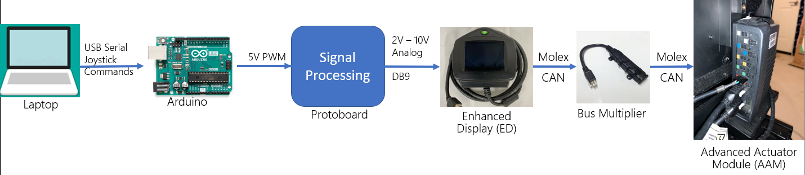
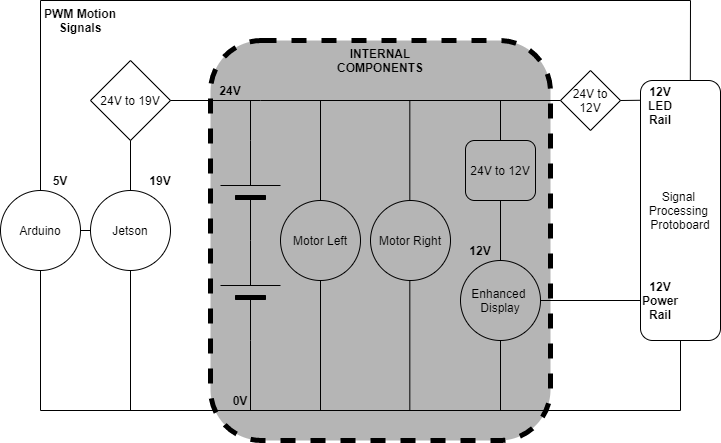

# EyeMove_Tung_Shared
For sharing information with University of Waterloo about interfacing with the Quantum Wheelchair

Model: Quantum Q6 Edge HD Powered Wheelchair

Interface Version: QLogic 2 Interface

Newer wheelchairs will have QLogic 3. Qlogic 2 is out of date, but cheap on used market.

## Documentation Summary

The _documentation_ folder contains the documents given to us by our Quantum contact.
The Q_Logic_Technical_Manual is for QLogic 2, which matches the wheelchair.
The Curtis manual is synonymous for QLogic 3, and thus not all features are supported by QLogic 2.
The Omni manual is for a Curtiss-Wright interface, which is extremely similar to the Qlogic interface.
They are designed to be the same. 
The Qlogic manual doesn't talk about the specific electrical signals and voltage levels expected.
The Omni manual does in Chapter 6.

### CAN Bus
In short, the wheelchair uses a DB9 connector through the Enhanced Display module.
The internal interface is CAN, but analog DB9 is far easier to work with.
In order to use the Enhanced Display module, it must be connected to the wheelchair's CAN bus using the 6-pin Molex MiniFit Jr plug.
This is plugged into the small bus multiplier module conncted to the Advanced Actuator Module (AAM) fixed on the seat's back.
This acts essentially as a USB hub for CAN and allows multiplexing of the single hardware port of the AAM. 

### DB9 Interface
Only pins 1,2,3,7,8,9 are relevant.
8 must be grounded, and 7 and 9 are shorted together providing a 12V 100mA supply.
1 and 2 are speed and direction (rotation rate) respectively, and 3 is center.
Center must be 6V (middle of the supply pins).
Center provides the "neutral" voltage for 1 and 2.
Applying a votage greather drives speed up and rotates right, and lower than 6 drives backwards and rotates left.
It is important that at wakeup, while the wheelchair is turning on, that pins 1,2,3 are all 6V. 
This is the purpose of the extra state machine logic and WAKEUP state in the Arduino code.
If not, the wheelchair will not properly detect a valid joystick and error out.

### Turning On
The wheelchair can have several joysticks. In our case, it had the main hand joystick and our "mock" joystick through the Enchanced Display.
It can wake up to a single joystick based on where it turns on from, and will only accept input from that source.
It can be turned off from any source.
Thus, to use your own joystick the wheelchair must be turned on from the Enhanced Display. 
This can be done with the green button, or using the 3.5mm egg switch plugged into the ON/OFF port as denoted in the documentation.

## Hardware

The high-level design of the interface is shown below:

This shows where the Bus Multiplier, ED, and AAM fit in. 
Our group specifically used a Jetson Xavier for the laptop.
All that is needed to drive the chair is to apply a steady voltage to the 1 and 2 pins in the range of 4-8V.
Our group used an Arduino to output a high frequency 5V PWM signal (since the jetson or arduino cannot output straight analog voltages).
We then used a signal processing circuit to convert the PWM to analog voltages.
First we smoothed them out using a passive 1st order RC filter, and then amplified them x2 with an active opamp. 
This gives voltages in the 0-10V range, and makes it easy to tune for the right range in software.
The signal processing circuit is shown below:

The diagram of the overall power system is shown below. This has extra details specific to our project, but I added it in case it is helpful.

## Code

The _arduino\_controller_ folder contains our simplified Arduino code. 
This should provide a helpful starting point if you want to use an Arduino for controlling it.

The scripts folder has our laptop-side of the USB serial communication.

